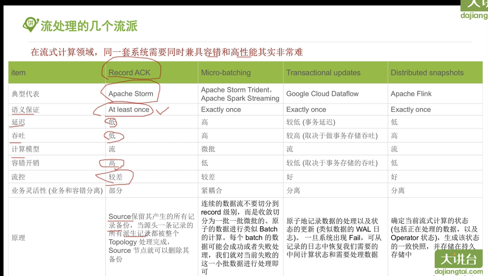
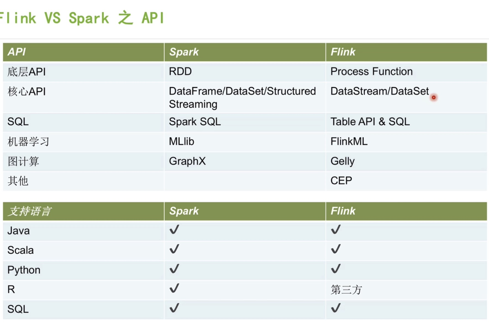

大数据埋点
- [网站统计中的数据收集原理及实现](http://blog.codinglabs.org/articles/how-web-analytics-data-collection-system-work.html)
- [Introduction to ga.js (Legacy)](https://developers.google.com/analytics/devguides/collection/gajs/)
- [analytics.js](https://developers.google.com/analytics/devguides/collection/analyticsjs)
- [Nginx 重新加载日志配置](https://www.cnblogs.com/helloworldPC/p/8981218.html)

hadoop优化
    
    - 硬件优化
    1. 多网卡绑定为一个IP
    2. 多磁盘
    3. 超线程
    4. 双电源

    - 操作系统层面调优
    1. 文件句柄和进程数限制
    2. 禁用电源管理(省点模式)
    3. 禁用selinux
    4. noatime

    - jvm优化
    1. 最新、稳定版jdk
    2. 合理的堆内存大小
    3. jstat
    4. jvisualvm+jstatd
    5. 远程debug jdwp
    
    - hadoop层面优化
    1. 机架感知（hadoop对机架的感知并非自适应，需人为指定。启动时，将rack信息保存在内存中。）
        第一个block副本存放在client所在node(若client不在集群，随机)
        第二个block副本与第一个不同机架
        第三个block副本与第二个同一机架，不同node
        
        可用python实现，或shell
    2. 多磁盘
        hdfs数据目录配置多个目录
        mr中间目录配置多个，分散IO压力
    3. 合理的压缩算法  snappy等
    4. 其他:
        有效的监控、调试工具(监控工具 nmon)
        根据节点情况调整task并行度
        使用combiner
        重用writable类型
       
hbase优化：

    1. 适当增加列族个数
    2. 预建分区，避免热点
    3. 合理规划hfile大小，避免split
    4. maxversion设为1
    5. 高宽表结合：随时间变化的指标数据可以采用宽表，以时间段作为列名
                避免太宽导致单条数据过大，可以高宽表结合，以10min为一时间段，每天单起一行记录
    6. rowkey设计，long.maxvalue - timestamp，新写入的数据可以快速命中
    7. 使用写缓存、批量读写、第三方前段缓存、blockcache、适当放宽fluse门槛(增大缓存命中率，降低磁盘写入)、允许丢失数据，则关闭wal
       blukload入库(基于mr思想，直接生成hbase底层数据文件，不写wal，降低大量IO，几乎不影响读，适合入库实时性能不高的场景)          
    8. 忙时关闭major compact，闲时打开
    9. 合理使用压缩算法（一般推荐snappy，cpu不紧张、io紧张，用gzip）
    10. PrefixTreeCompression
    11. bloomfilter
    12. 使用较新版本
    13. 按天建表，最近时间段常驻内存(冷数据表关闭blockcache)
    14. 按天建表，当天适当增大副本(副本数越多，数据本地性变强，查询会变快。冷数据可降低副本，缓解副本整体存储的占用)
    
    
    
    
       
flink
不仅高吞吐、低延迟，而且：提供有状态的计算，支持转态管理，强一致性的数据语义，支持EventTime，WaterMark对消息乱序的处理

